# Edge TTS MCP Architecture

## System Overview

This document provides detailed architecture diagrams and configuration explanations for the Edge TTS Model Context Protocol (MCP) system integrated with GitHub Copilot.

## High-Level Architecture


## Detailed Component Architecture


## Configuration Flow Diagram


## MCP Protocol Communication

```mermaid
sequenceDiagram
    participant Service as edge-tts-service.js
    participant Container as Docker Container
    participant MCP as MCP Server (server.py)
    participant EdgeTTS as edge-tts Library

    Service->>Container: docker exec -i edge-tts python server.py
    Container->>MCP: Launch MCP server process

    rect rgb(230, 240, 255)
        Note over Service,MCP: Initialization Phase
        Service->>MCP: stdin: {"jsonrpc":"2.0","id":1,"method":"initialize",<br/>"params":{"protocolVersion":"2024-11-05",<br/>"capabilities":{},"clientInfo":{"name":"edge-tts-service"}}}
        MCP->>Service: stdout: {"jsonrpc":"2.0","id":1,<br/>"result":{"protocolVersion":"2024-11-05",<br/>"capabilities":{"tools":{}},...}}
    end

    rect rgb(255, 240, 230)
        Note over Service,EdgeTTS: Tool Call Phase
        Service->>MCP: stdin: {"jsonrpc":"2.0","id":2,"method":"tools/call",<br/>"params":{"name":"speak",<br/>"arguments":{"text":"Hello world",<br/>"voice":"en-US-AriaNeural",<br/>"output_file":"/tmp/output.mp3"}}}
        MCP->>EdgeTTS: asyncio.run(Communicate(text, voice).save(output_file))
        EdgeTTS->>EdgeTTS: Generate MP3 audio
        EdgeTTS-->>MCP: MP3 saved to /tmp/output.mp3
        MCP->>Service: stdout: {"jsonrpc":"2.0","id":2,<br/>"result":{"content":[{"type":"text",<br/>"text":"✅ Text-to-speech conversion successful..."}]}}
    end

    rect rgb(230, 255, 240)
        Note over Service,Container: File Extraction Phase
        Service->>Container: docker cp edge-tts:/tmp/output.mp3 C:/temp/edge-tts-{timestamp}.mp3
        Container-->>Service: File copied to host
    end

    Service->>Service: Kill MCP process (stdin.end())
```



## Copilot Instruction Configuration

```mermaid
graph TB
    subgraph "Copilot Instructions (.github/copilot-instructions.md)"
        direction TB

        subgraph "Vocalization Rules"
            PreThought[PRE-THOUGHT VOCALIZATION<br/>✅ Before analyzing requests<br/>✅ Before using tools<br/>✅ Before decisions]
            PostExec[POST-EXECUTION VOCALIZATION<br/>✅ After completing tasks<br/>✅ After tool execution<br/>✅ After findings]
            Forbidden[FORBIDDEN PATTERNS<br/>❌ Silent work start<br/>❌ No completion summary<br/>❌ Silent tool execution]
        end

        subgraph "Service Configuration"
            Endpoint[Service Endpoint<br/>localhost:3006]
            FilePattern[Temp File Pattern<br/>C:/temp/speak-{timestamp}.txt]
            HTTPCall[HTTP Method<br/>GET /speak-from-file]
        end

        subgraph "Implementation Pattern"
            Step1[1. Create temp file with message]
            Step2[2. Call fetch_webpage with file path]
            Step3[3. Service auto-deletes temp file]
            Step4[4. Audio plays through speakers]
        end

        PreThought --> Step1
        PostExec --> Step1
        Step1 --> Step2
        Step2 --> Step3
        Step3 --> Step4
        Endpoint -.-> HTTPCall
        FilePattern -.-> Step1
    end

    subgraph "Copilot Execution"
        Agent[Copilot Agent]
        Tools[Tool Invocations<br/>create_file, fetch_webpage]
    end

    PreThought -->|Enforces| Agent
    PostExec -->|Enforces| Agent
    Forbidden -->|Prevents| Agent
    Agent --> Tools

    style PreThought fill:#c8e6c9
    style PostExec fill:#c8e6c9
    style Forbidden fill:#ffcdd2
    style Agent fill:#bbdefb
```

## Docker Container Configuration


## File Flow Architecture

```mermaid
graph LR
    subgraph "Copilot Workspace"
        CP[Copilot Agent]
    end

    subgraph "Windows File System"
        TempIn[C:/temp/speak-timestamp.txt<br/>Input: Text to speak]
        TempOut[C:/temp/edge-tts-timestamp.mp3<br/>Output: Audio file]
    end

    subgraph "Docker Container"
        ContainerMP3[c:/tmp/output.mp3 Generated audio]
    end

    subgraph "Edge TTS Service"
        ReadFile[Read text from file]
        DeleteFile[Delete input file]
        PlayFile[Play MP3 via PowerShell]
    end

    CP -->|create_file| TempIn
    CP -->|fetch_webpage| ReadFile
    ReadFile -->|Reads| TempIn
    ReadFile -->|MCP call generates| ContainerMP3
    ContainerMP3 -->|docker cp| TempOut
    TempOut -->|Play| PlayFile
    PlayFile -->|Audio| Speakers((🔊))
    ReadFile -->|Cleanup| DeleteFile
    DeleteFile -->|Removes| TempIn

    style TempIn fill:#fff9c4
    style ContainerMP3 fill:#c5e1a5
    style TempOut fill:#b3e5fc
    style Speakers fill:#ff8a80,color:#fff
```



## Service Startup Flow


## Error Handling & Recovery


## Configuration Summary

### Copilot Configuration
- **Location**: `.github/copilot-instructions.md`
- **Service Endpoint**: `http://localhost:3006`
- **Temp File Pattern**: `C:/temp/speak-{timestamp}.txt`
- **Mandatory Behavior**:
  - Pre-thought vocalization before any action
  - Post-execution summary after completion
  - No silent operations permitted

### Docker MCP Server
- **Container Name**: `edge-tts`
- **Image**: `edge-tts-mcp`
- **Restart Policy**: `always` (auto-start with Docker)
- **Communication**: stdio via `docker exec -i`
- **Protocol**: JSON-RPC 2.0, MCP version 2024-11-05
- **Tools**: `speak`, `list_voices`

### Edge TTS Service
- **Port**: 3006
- **Endpoints**: `/speak-from-file`, `/health`, `/stats`
- **Audio Output**: Windows MediaPlayer (PresentationCore assembly)
- **Temp Directory**: `C:/temp`
- **File Cleanup**: Automatic deletion after processing

### Audio Playback
- **Method**: PowerShell with System.Windows.Media.MediaPlayer
- **Format**: MP3
- **Duration Handling**: Waits for full playback completion
- **Location**: `C:/temp/edge-tts-{timestamp}.mp3`

