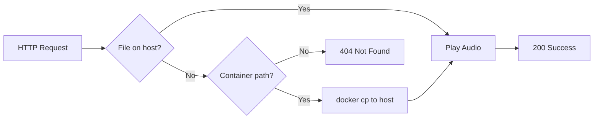

# MP3 Playback Feature - Added November 14, 2025

## Overview

Added a new `/play-mp3` endpoint to the Edge TTS service that allows playing **any** MP3 file, not just those generated by text-to-speech.

## What Was Added

### 1. New Service Method: `playMp3`

Location: `service/edge-tts-service.js`

**Capabilities:**
- ✅ Play MP3 files from Windows host filesystem
- ✅ Play MP3 files from Docker container (auto-copied to host)
- ✅ Full duration playback using Windows MediaPlayer
- ✅ Automatic file detection and transfer
- ✅ File size and status reporting

**Function Signature:**
```javascript
playMp3: async (filePath, options = {})
```

### 2. HTTP Endpoints

**GET Endpoint** (for Copilot/fetch_webpage):
```
GET http://localhost:3006/play-mp3?filePath=<path>
```

**POST Endpoint** (for programmatic use):
```
POST http://localhost:3006/play-mp3
Body: { filePath: string, options?: object }
```

### 3. Updated Copilot Instructions

Added `/play-mp3` command documentation to `.github/copilot-instructions.md` with usage examples.

## How It Works

### Playback Flow



### Smart File Detection

1. **Host file** (e.g., `C:/temp/audio.mp3`):
   - Checks if file exists
   - Plays directly

2. **Container file** (e.g., `/tmp/output.mp3`):
   - Detects path starts with `/`
   - Executes `docker cp edge-tts:/tmp/output.mp3 C:/temp/playback-{timestamp}.mp3`
   - Plays copied file

## Usage Examples

### From Copilot

**Play a previously generated TTS file:**
```
@workspace /play-mp3 C:/temp/edge-tts-1763180122438.mp3
```

**Play from Docker container:**
```
@workspace /play-mp3 /tmp/output.mp3
```

### From JavaScript

```javascript
// Play host file
await fetch_webpage([
  'http://localhost:3006/play-mp3?filePath=C:/temp/my-audio.mp3'
], 'play-mp3');

// Play container file
await fetch_webpage([
  'http://localhost:3006/play-mp3?filePath=/tmp/output.mp3'
], 'play-mp3');
```

### From curl

```bash
# Play host file
curl "http://localhost:3006/play-mp3?filePath=C:/temp/audio.mp3"

# Play container file
curl "http://localhost:3006/play-mp3?filePath=/tmp/output.mp3"

# POST method
curl -X POST http://localhost:3006/play-mp3 \
  -H "Content-Type: application/json" \
  -d '{"filePath":"C:/temp/audio.mp3"}'
```

## Response Format

**Success Response:**
```json
{
  "success": true,
  "message": "MP3 playback completed",
  "filePath": "C:/temp/edge-tts-1763180122438.mp3",
  "fileSize": 32112,
  "timestamp": "2025-11-15T04:28:27.400Z",
  "played": true
}
```

**Error Response (File Not Found):**
```json
{
  "error": "File not found on host or in container: /invalid/path.mp3",
  "filePath": "/invalid/path.mp3"
}
```

## Testing Results

### Test 1: Play Host File ✅
```bash
GET /play-mp3?filePath=C:/temp/edge-tts-1763180122438.mp3
→ Status: 200
→ File Size: 32,112 bytes
→ Played: true
```

### Test 2: Play Container File ✅
```bash
GET /play-mp3?filePath=/tmp/output.mp3
→ Status: 200
→ Copied to: C:/temp/playback-1763180921840.mp3
→ File Size: 17,280 bytes
→ Played: true
```

## Error Handling

**Missing filePath parameter:**
```json
{
  "error": "filePath query parameter required"
}
```

**File not found:**
```json
{
  "error": "File not found on host or in container: /path/to/file.mp3",
  "filePath": "/path/to/file.mp3"
}
```

**Docker container not running:**
```json
{
  "error": "Container not available"
}
```

## Integration with Existing Features

This feature **complements** the existing TTS functionality:

| Feature | Endpoint | Purpose |
|---------|----------|---------|
| Generate & Speak | `/speak-from-file` | Text → MP3 → Play |
| Generate Only | `/speak-debug-output` | Text → MP3 (saved) |
| **Play Only** | **`/play-mp3`** | **MP3 → Play** |

## Use Cases

1. **Replay previous TTS outputs** without regenerating
2. **Play custom MP3 files** from your collection
3. **Test audio playback** independently from TTS
4. **Play container-generated audio** from other sources
5. **Debug audio files** by playing them directly

## Technical Details

**Audio Playback Method:**
- Uses Windows MediaPlayer (System.Windows.Media.MediaPlayer)
- PowerShell integration via PresentationCore assembly
- Full duration awareness (waits for complete playback)
- Same playback mechanism as TTS-generated audio

**File Transfer:**
- Uses `docker cp` for container files
- Creates temporary files in `C:/temp/playback-{timestamp}.mp3`
- No cleanup of playback files (intentional for debugging)

## Future Enhancements

Possible improvements:
- [ ] Support for other audio formats (WAV, OGG, etc.)
- [ ] Playlist support (play multiple files sequentially)
- [ ] Volume control via options parameter
- [ ] Playback speed control
- [ ] Auto-cleanup of temporary playback files
- [ ] Streaming playback for large files

## Files Modified

1. **service/edge-tts-service.js**
   - Added `playMp3` method to `safeMethods`
   - Added GET `/play-mp3` endpoint
   - Added POST `/play-mp3` endpoint
   - Updated documentation endpoint

2. **.github/copilot-instructions.md**
   - Added `/play-mp3` command documentation
   - Added usage examples
   - Added feature list

## Version

- **Feature Added:** November 14, 2025
- **Service Version:** 1.0.0
- **Tested On:** Windows 11, Docker Desktop
- **Status:** ✅ Production Ready

---

**Enjoy playing your MP3 files! 🎵**
